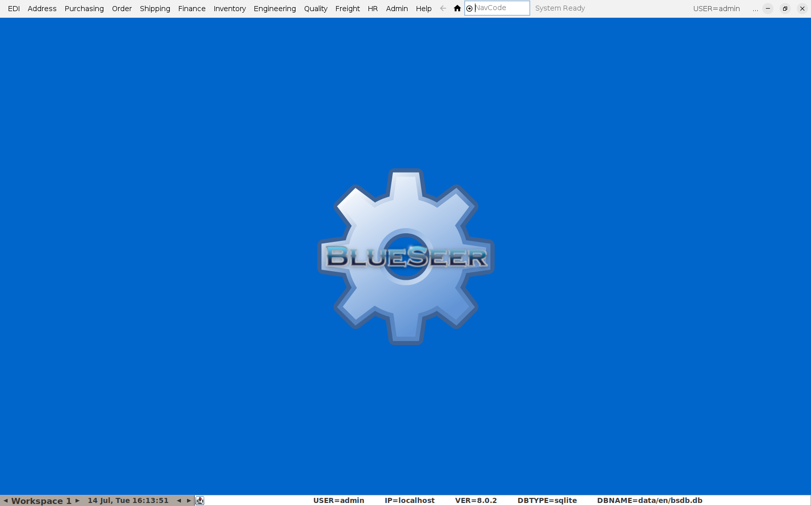
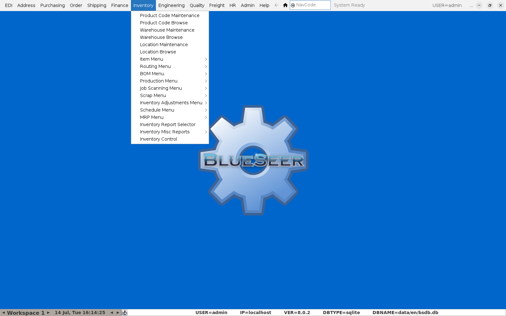

# Getting Started

This guide covers the day-to-day workflows a bakery/food-production user needs in
BlueSeer: setting up items and recipes, running production and printing labels,
handling recalls, sales orders, credit notes, purchasing, stock reporting, and
exporting sales to your accounting system.

Each guide is a separate page — see the [index](README.md) for the full list.

## Logging in

BlueSeer opens to a login panel. Enter your username and password and click
**Login**.

## The main window

After logging in you land on the main BlueSeer desktop. Everything is reached
from the menu bar across the top — there is no separate "home" screen to
navigate away from.

The menus are organized by function, not by department, so the same screen is
often reached the same way regardless of your role:

- **Inventory** — items, BOMs/recipes, production, routing, cost, MRP, stock
  reports.
- **Purchasing** — purchase orders, requisitions, vendor pricing.
- **Order** — sales orders, quotes.
- **Shipping** — serialized shippers/invoicing, freight.
- **Quality** — QPR (quality problem reports), the Nutrition Completeness
  Report, and the Lot Genealogy / Recall Lookup.
- **Finance** — AR/AP, GL, credit/debit memos, and the ledger reports used
  to export to an accounting system.
- **Address** — customers, vendors, and other address-book entries.
- **EDI** — electronic document exchange (X12/EDIFACT trading partners).

Opening the **Inventory** menu, for example, shows every inventory-related
screen grouped into submenus:

## Finding a screen quickly

Every screen also has a short **NavCode** — type it into the box at the top of
the window (next to the home icon) and press Enter to jump straight there
instead of navigating the menus. The relevant guide below calls out the
NavCode for each screen where one is set up.

## Conventions used in this guide

- **Bold** text is something you click or type.
- Screens that list/search records (almost every "Maintenance" screen) follow
  the same shape: a search field and magnifying-glass icon, an **Item
  Number**/key field, an **Add**/**Update**/**Delete** button, and a **New**/
  **Clear** button to start a blank record.
- Screenshots in this guide were taken against a sample bakery dataset (item
  `CAKE001` — Chocolate Sponge Cake — and its raw materials) so you can see
  real data flowing through each screen.
