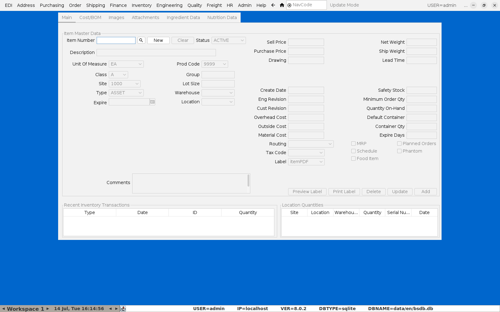
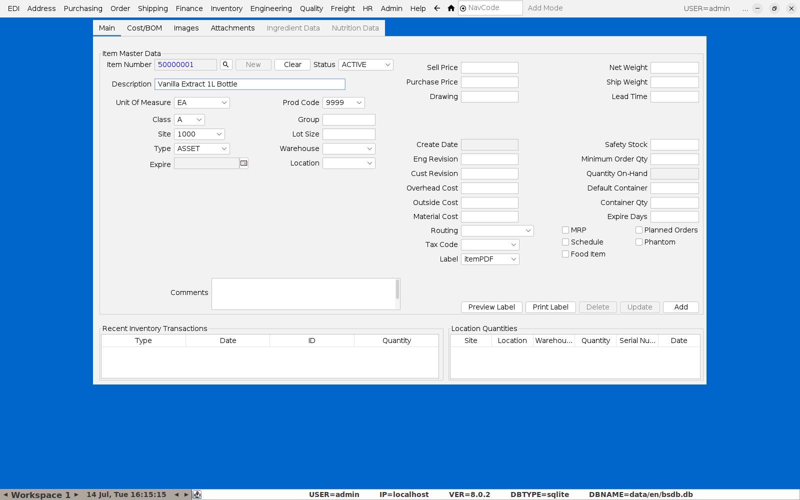
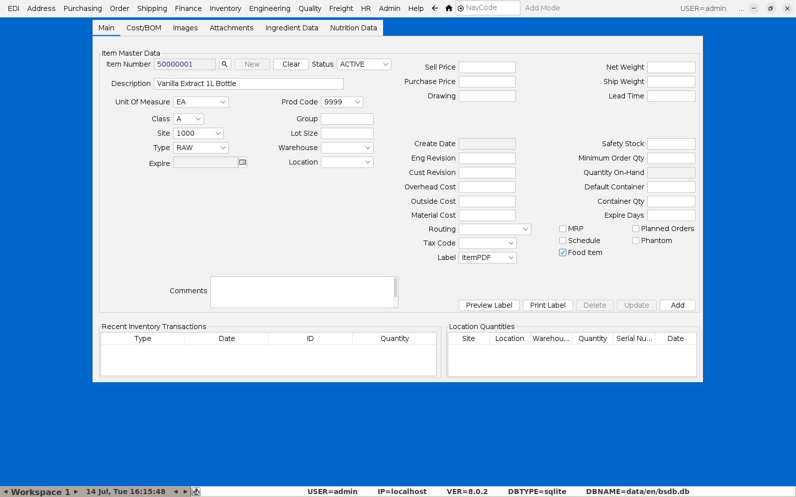
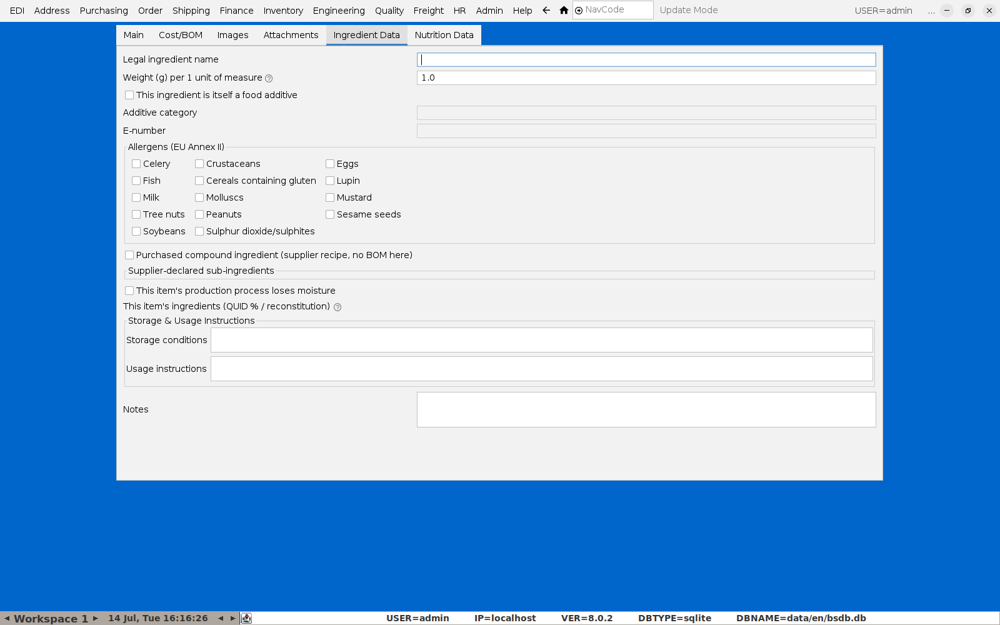
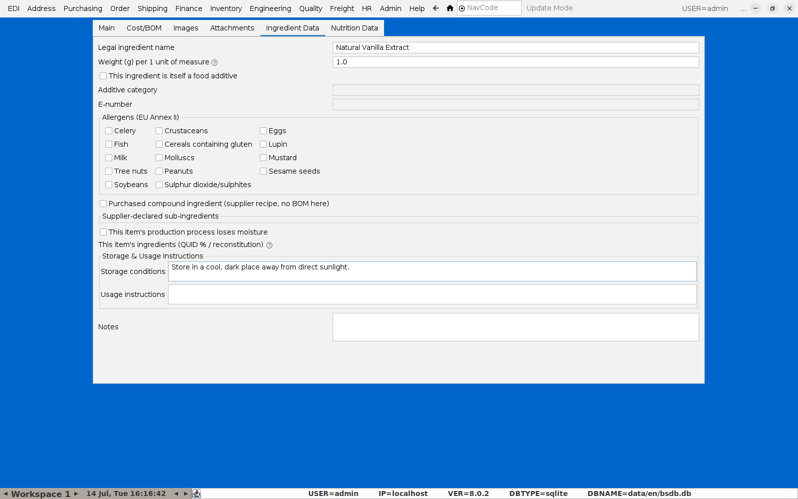

# Adding a New Item

Every item BlueSeer tracks — finished goods, raw materials, packaging, tooling,
services — is set up on one screen: **Item Maintenance**.

**Menu:** Inventory → Item Menu → Item Maintenance

## 1. Open a blank record

Item Maintenance opens showing whatever item was last looked at (or blank on
first use). Click **New** to clear the form and start a fresh item.

## 2. Fill in the basics

- **Item Number** — BlueSeer assigns the next number automatically once you
  save; you don't need to type one yourself.
- **Description** — the internal description (this is *not* the label-facing
  legal name for food ingredients — see step 4).
- **Type** — classifies the item for reporting and costing:

  | Type | Meaning |
  |---|---|
  | `RAW` | Raw material / ingredient |
  | `SUB` | Sub-assembly (an in-house intermediate with its own BOM) |
  | `FG` | Finished good |
  | `CONT` | Container / packaging |
  | `SERVICE` | Non-stocked service item |
  | `TOOLING` | Tooling |
  | `ASSET` | Fixed asset (default) |

- **Unit of Measure**, **Site**, **Warehouse**, **Location** as appropriate.

## 3. Food Item flag

If this item is (or is used as) a food ingredient — including a finished
product that itself needs an ingredient declaration — check **Food Item** on
the Main tab. This is what reveals the **Ingredient Data** and **Nutrition
Data** tabs; they stay hidden and disabled for anything else (packaging,
tooling, non-food raw materials), so the catalog isn't cluttered with
food-specific fields for items that don't need them.

Click **Add** to save the new item.

## 4. Ingredient Data (food items only)

Reload the item and open the **Ingredient Data** tab to fill in the
label-facing details:

- **Legal ingredient name** — the name that appears on a printed ingredient
  list (often different from the internal Description — e.g. "Sugar" vs.
  "GRANULATED SUGAR 25KG BAG").
- **Weight (g) per 1 unit of measure** — only needs changing for a
  volume-tracked ingredient (mL/L); leave as `1` for anything already tracked
  by weight.
- **Food additive / E-number**, **Allergens (EU Annex II)**, **Purchased
  compound ingredient** (for a bought-in item like chocolate chips that
  BlueSeer has no BOM for — its supplier-declared sub-ingredients go here
  instead), and **Storage & Usage Instructions**.

Fill in what applies and switch back to the **Main** tab, then click
**Update** to save — Ingredient Data and Nutrition Data save together with
the rest of the item record, there's no separate save button on those tabs.

## 5. Nutrition Data (food items only)

The **Nutrition Data** tab works the same way — per-100g values for the
mandatory nutrients (energy, fat, saturates, carbohydrate, sugars, protein,
salt) plus optional ones, where this item is used as a leaf ingredient in a
recipe, and label placement/exemption settings where it's a finished product.
See [Creating a Recipe](02-creating-a-recipe.md) for how these values roll up
through a BOM into a printed nutrition panel.

## Packaging and other non-food items

For packaging, tooling, or any other non-food raw material, just leave **Food
Item** unchecked. The item behaves like a normal BlueSeer item with no extra
tabs — and critically, it's automatically excluded from any finished
product's printed ingredient list and nutrition panel even if it's added to a
recipe's BOM, so a box or a label never accidentally shows up as an
"ingredient."
