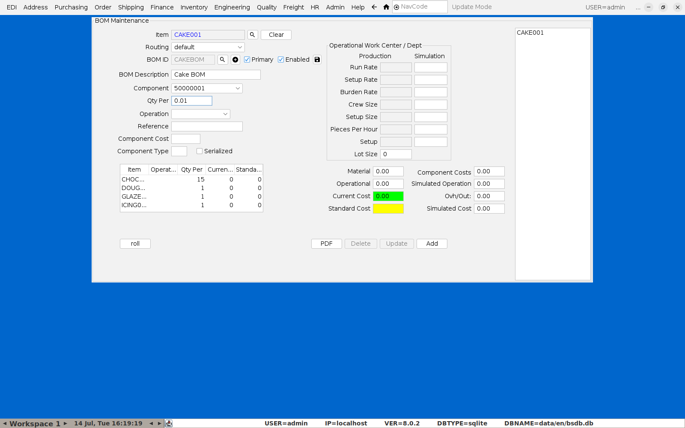

# Creating a Recipe (BOM)

A "recipe" in BlueSeer is a Bill of Materials (BOM) — the same mechanism used
for any manufactured item, food or otherwise. A finished good's BOM lists its
ingredients/components and how much of each goes into one unit.

**Menu:** Inventory → BOM Menu → BOM Maintenance

## 1. Load (or start) an item's BOM

Type the finished item's code into **Item** and press Enter. If a BOM already
exists it loads immediately, showing the BOM ID/description and every
component line with its quantity and cost.

For a brand-new item with no BOM yet, the **Item** field will come back empty
below the header — click the **+** button next to **BOM ID** to start a new
BOM for it, give it a description, and begin adding components as below.

## 2. Reading an existing recipe

Each row in the component list is one ingredient/sub-assembly:

- **Item** — the component's item code (raw material or in-house
  sub-assembly).
- **Qty Per** — how much of it goes into **one unit** of the parent item.
- **Current/Standard cost** — rolled-up cost columns, kept in sync with each
  component's own item cost.

A sub-assembly component (an in-house intermediate that itself has a BOM —
`SUB` type, e.g. a sponge dough or icing made in advance) is just another
line here; BlueSeer recurses into its BOM automatically wherever the recipe
is used for costing, ingredient lists, or nutrition rollups — you don't need
to flatten it by hand.

## 3. Adding a component

- Pick the component from the **Component** dropdown (every item in the
  catalog is available here — see [Adding a New Item](01-adding-a-new-item.md)
  if the ingredient doesn't exist yet).
- Enter **Qty Per** — the amount of that component used per one unit of the
  parent item, in the component's own unit of measure.
- Click **Add**.

If BlueSeer rejects the line with **"Must be a legitimate value,"** double
check every numeric field on the entry form (Qty Per, Component Cost) has a
value rather than being blank, and that **Routing**/**Operation** matches how
this item's routing is set up — some routings require an operation to be
selected per BOM line (Inventory → Routing Menu) before a component can be
added.

## 4. Ingredient list and nutrition roll-up

Once a recipe is complete, two things use it automatically without any extra
setup:

- **Printed ingredient list** — every `RAW`/`SUB` component with **Food
  Item** checked contributes to the finished item's EU/Irish FIC ingredient
  declaration, in descending order by weight, with allergens bolded. Any
  component *without* Food Item checked (packaging, etc.) is skipped
  automatically — see [Adding a New Item](01-adding-a-new-item.md).
- **Nutrition panel** — the same recipe rolls up each component's per-100g
  nutrition values into the finished item's own nutrition declaration.

Both are generated when printing the item's label — see [Producing a Batch
and Printing Labels](03-producing-a-batch-and-labels.md).

## 5. Checking the recipe is complete before you rely on it

Before trusting a new or edited recipe for label printing, run the
**Nutrition Completeness Report** (Quality menu) — it flags any finished
item whose recipe is missing required ingredient/nutrition data across the
*whole* catalog, not just the one item you're looking at.
