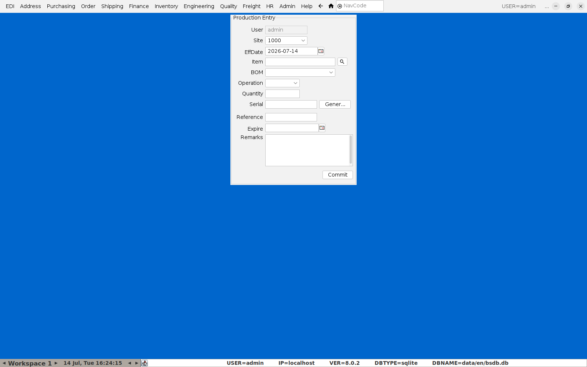
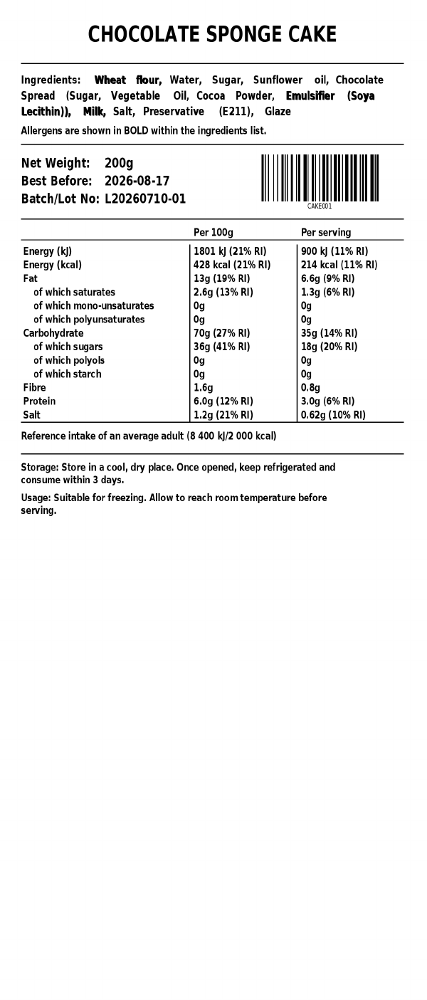

# Producing a Batch and Printing Labels

This covers reporting a production run against a recipe (assigning it a
batch/serial number) and printing the item's label — ingredient list and
nutrition panel included — for that run.

## 1. Report the production

**Menu:** Inventory → Production Menu → Production Entry

- **Item** — the finished good being produced. Its primary BOM loads
  automatically into the **BOM** field.
- **Quantity** — how many units this run produced.
- **Serial** — this *is* the batch/lot number for the run. Click
  **Gener...** to have BlueSeer assign the next number automatically, or
  type your own if you have an external batch-numbering convention.
- **Expire** — the best-before/use-by date for this specific batch. Set
  this — it's what ends up on the printed label as **Best Before**, and it's
  also what BlueSeer uses later to relieve this batch first-expiry-first-out
  when it's shipped (see [Putting an Order Through](05-sales-orders.md)).
- **Operation** only needs a value if this item's routing requires one for
  a partial/in-process report; leave blank for a simple one-step recipe.

Click **Commit**. BlueSeer confirms with "Record Added Successfully" and the
new batch immediately shows up:

- On **Item Maintenance** for that item, under **Location Quantities**
  (site/location/quantity/serial number/date) and in **Recent Inventory
  Transactions** (an `RCT-FG` line for the quantity produced).
- Available to [Putting an Order Through](05-sales-orders.md) and to
  [Lot Genealogy / Recall Lookup](04-lot-recall.md) as soon as it's
  consumed or shipped.

## 2. Printing the label

**Menu:** Inventory → Item Menu → Item Maintenance, load the item, then
**Preview Label** or **Print Label** at the bottom of the Main tab.

For a **Food Item** (see [Adding a New Item](01-adding-a-new-item.md)) with
a complete recipe, this generates the full EU/Irish FIC label in one step —
no manual assembly required:

Everything on this label is generated automatically from data already
entered elsewhere:

- **Ingredient list** — descending by weight, straight from the recipe
  (see [Creating a Recipe](02-creating-a-recipe.md)), with allergens
  **bolded**.
- **Nutrition panel** — per-100g and per-serving, rolled up from each
  ingredient's Nutrition Data.
- **Batch/Lot No.** and **Best Before** — the serial/expiry from the most
  recent production run for this item (step 1 above).
- **Storage/Usage** text — from each ingredient's Ingredient Data tab.

**Preview Label** opens it on-screen first; **Print Label** sends it
straight to the configured label printer/output. Always preview after
producing a new batch or editing a recipe, to catch anything unexpected
before it goes on real packaging.

## 3. Before you rely on a label

Run the **Nutrition Completeness Report** (Quality menu) across the catalog
periodically — it catches a recipe with missing ingredient or nutrition data
*before* someone tries to print a label for it, which is a much better time
to find out than after packaging has already gone out.
