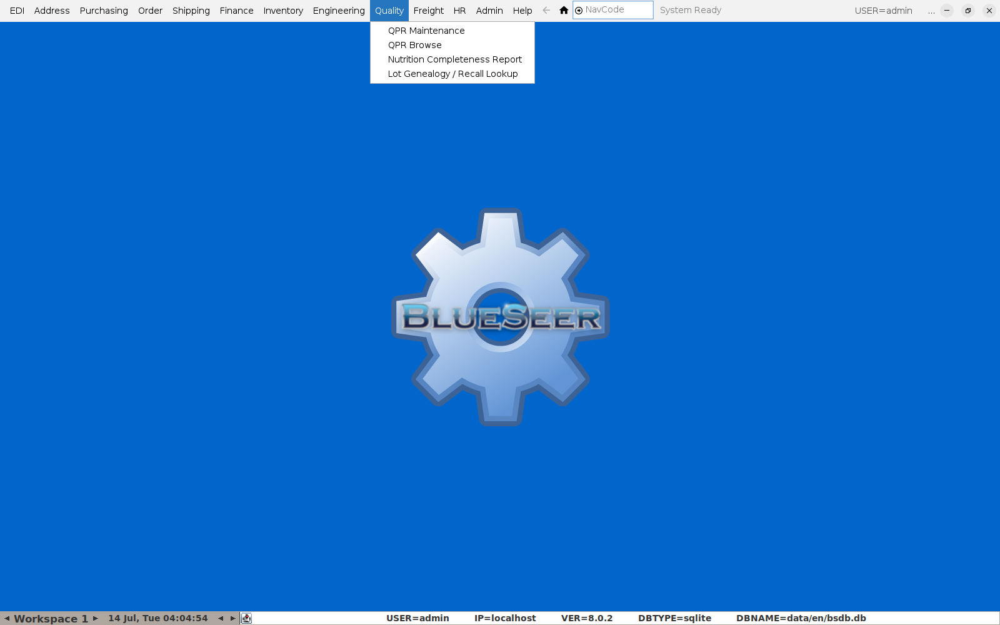
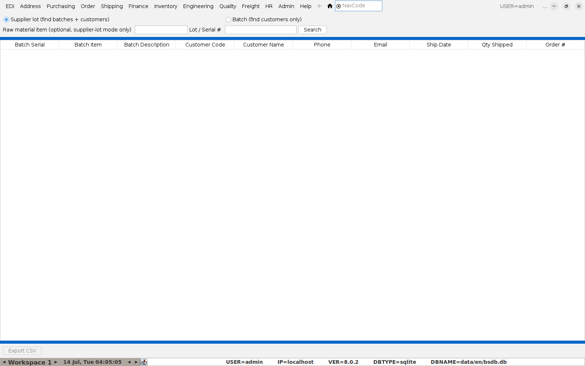
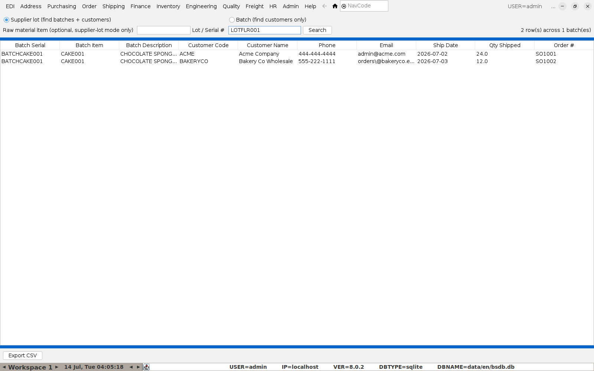
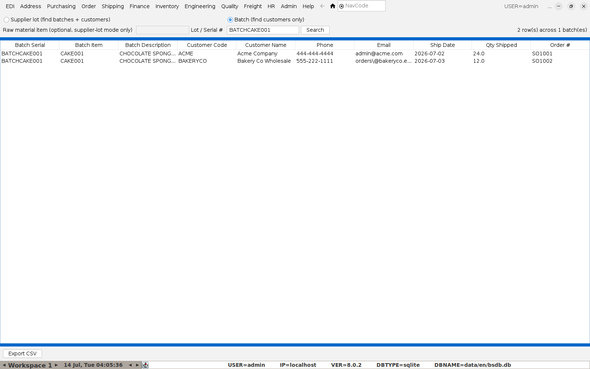
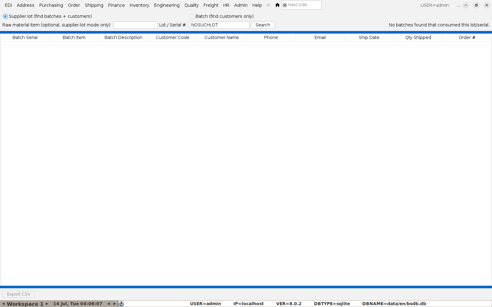

# Doing a Recall (Lot Genealogy Lookup)

If a supplier tells you an ingredient lot is bad, or you need to pull a
finished batch for any other reason, this screen answers the two questions
that matter: **what did it go into**, and **who received it**.

**Menu:** Quality → Lot Genealogy / Recall Lookup

There are two lookup directions, chosen with the radio buttons at the top.
Both produce the same style of results table: batch, item, and every
customer who received that batch.

## Scenario 1 — "This supplier lot is bad, what does it affect?"

Select **Supplier lot**, enter the raw material's lot/serial number (from
your goods-in records), and optionally narrow it to a specific raw-material
item if you have reason to think the same lot number might exist under more
than one item. Click **Search**.

This walks every production batch that consumed the lot, then every
customer shipment of each of those batches — one search covers the whole
chain from raw material to customer.

## Scenario 2 — "We need to recall this batch, who has it?"

Select **Batch**, enter the finished good's own batch/serial number
directly (the same number printed on the label — see [Producing a Batch and
Printing Labels](03-producing-a-batch-and-labels.md)), and click **Search**.

This skips straight to the customer list for that one batch — use it when
you already know the batch and don't need the upstream raw-material trace.

## No matches

If nothing comes back, the summary line says so directly rather than
leaving a blank table — "No batches found that consumed this lot/serial"
for a supplier-lot search with nothing, or a single "(no shipments found for
this batch yet)" row for a batch that hasn't shipped:

## Exporting for the recall record

Click **Export CSV** to save the results table — this is the artifact to
attach to your HACCP recall documentation or hand to an auditor, rather than
screenshotting the on-screen table.

## A limitation worth knowing

The supplier-lot search direction only finds a link if production was
reported in a way that recorded which specific incoming lot was consumed
(see [Producing a Batch and Printing Labels](03-producing-a-batch-and-labels.md)
for the normal Production Entry flow, which does capture this). If your
site uses a bulk backflush or barcode-scan production process that doesn't
select a specific component lot, that production run won't show up in a
supplier-lot search — only in a direct batch search. If recall coverage
from raw material forward is important for your process, make sure
whichever screen your team uses to report production actually records the
component lot consumed, not just the item and quantity.
