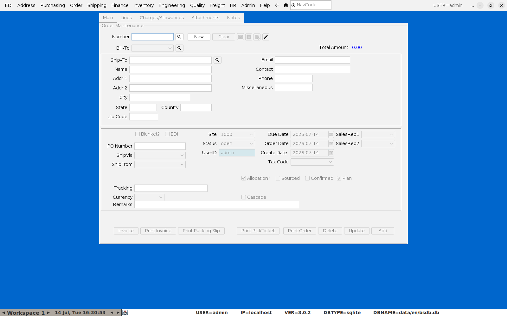
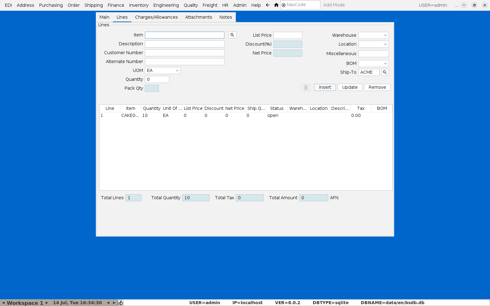
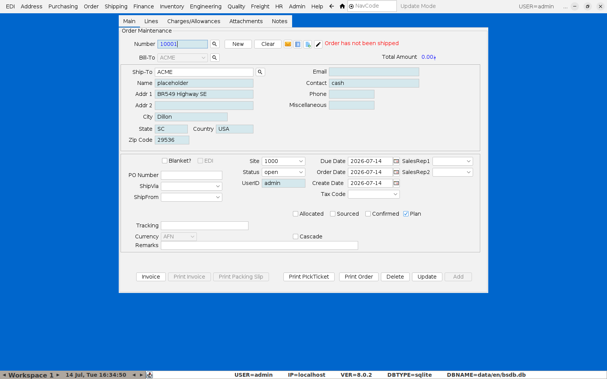
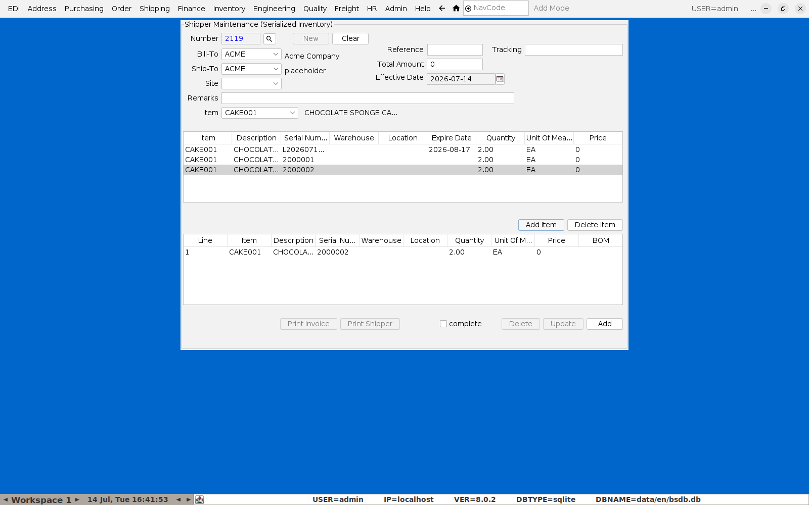

# Putting an Order Through

**Menu:** Order → Order Maintenance

## 1. Header

Click **New** — BlueSeer assigns the next order number. Pick **Bill-To**
(the customer); **Ship-To**, address, and contact details fill in
automatically from the customer record.

## 2. Lines

Switch to the **Lines** tab. Enter the **Item**, a **UOM** (required — pick
the item's own unit of measure if the field doesn't default), and
**Quantity**, then click **Insert** to add the line to the order.

Go back to the **Main** tab and click **Add** to commit the order header —
note BlueSeer requires at least one line to exist first, so **Add** the
lines before trying to commit the header if you see "There are no line
items."

## 3. Shipping / invoicing — and getting the batch number onto it

There are two ways to turn this order into a shipment, and **they are not
equivalent** for lot/batch traceability:

- **Order Maintenance's "Invoice" button** (Main tab) is a one-click
  shortcut — it relieves inventory generically and creates the shipment/
  invoice record, but it does **not** record which specific batch/serial was
  shipped. Confirmed by checking the resulting shipment record directly: the
  serial/lot fields come back blank. Fine for a non-food item, not
  acceptable if the batch number needs to be on the invoice.
- **Shipping → Shipper Maintenance (Serialized Inventory)** is the screen
  that actually captures this. Pick the customer and item, and it shows
  every available batch **with its expiry date**, letting you pick exactly
  which one to ship:

  

  Add the line, mark **complete**, and save — this is what puts the actual
  batch/serial number on the resulting invoice, and what makes the shipment
  show up correctly in [Lot Genealogy / Recall Lookup](04-lot-recall.md).

**If batch/lot numbers need to be on every invoice** (recommended for any
food product), use the serialized shipper screen as your standard shipping
process rather than the plain Order Maintenance "Invoice" shortcut.

## A gap worth knowing about

When testing this screen, the **Site** field came back with no selectable
options in some cases, which blocks saving. **Site** here is a
warehouse/site-level setting (Inventory menu), not something attached to
the customer — see [Setting Up Customers and Vendors](10-customers-vendors.md)
for where customer Ship-To addresses actually live. If you hit an empty
Site dropdown, check the site/warehouse configuration under Inventory
before relying on this screen for daily shipping.
