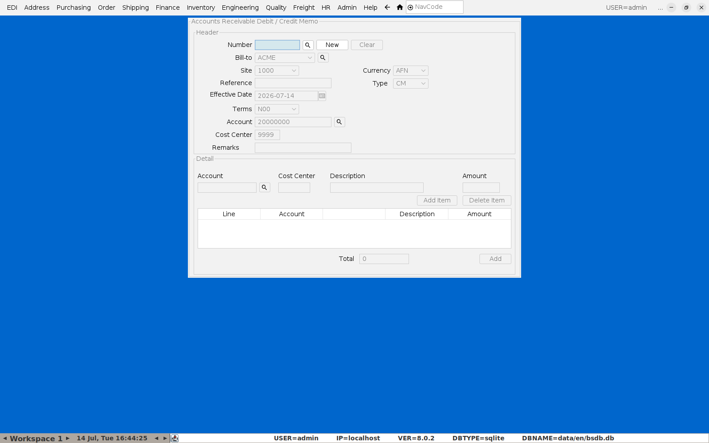
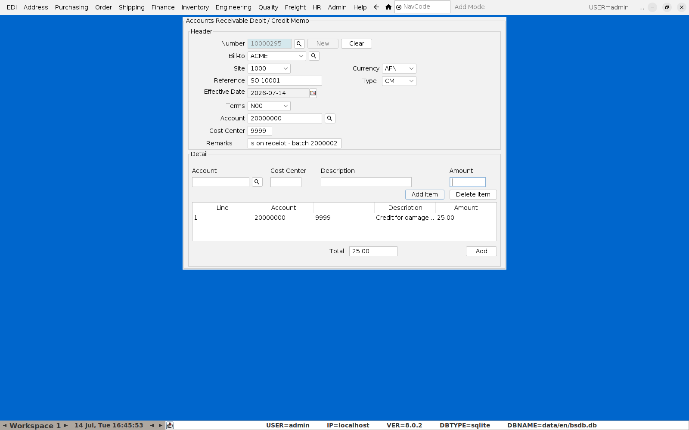

# Doing a Credit Note

**Menu:** Finance → Accounts Receivable Menu → Memo Maintenance

This screen handles both debit and credit memos against a customer account
— for a credit note, leave **Type** as **CM**.

## 1. Header

Click **New** — BlueSeer assigns the next memo number. Set:

- **Bill-to** — the customer being credited.
- **Reference** — the sales order or invoice number this credit relates to
  (free text — put the order number here so it's traceable back later).
- **Account** / **Cost Center** — the GL account this credit posts against;
  defaults from the customer record.
- **Remarks** — reason for the credit (e.g. "Damaged goods on receipt —
  batch 2000002"). If the credit relates to a specific production batch,
  note the batch number here so it's on record alongside the GL entry.

## 2. Detail line(s)

In the **Detail** section, enter the **Account**, **Cost Center**,
**Description**, and **Amount** for the credit, then click **Add Item** to
move it into the line table. A memo can have multiple lines against
different accounts if needed — repeat for each.

## 3. Save

Click **Add** at the bottom to commit the memo. BlueSeer confirms with
"Record Added Successfully" and clears the form.

This posts the credit to the customer's AR account — check **Finance →
Accounts Receivable Menu → AR Aging View** or **AR Transaction Report** to
confirm it landed against the right customer and reference.
