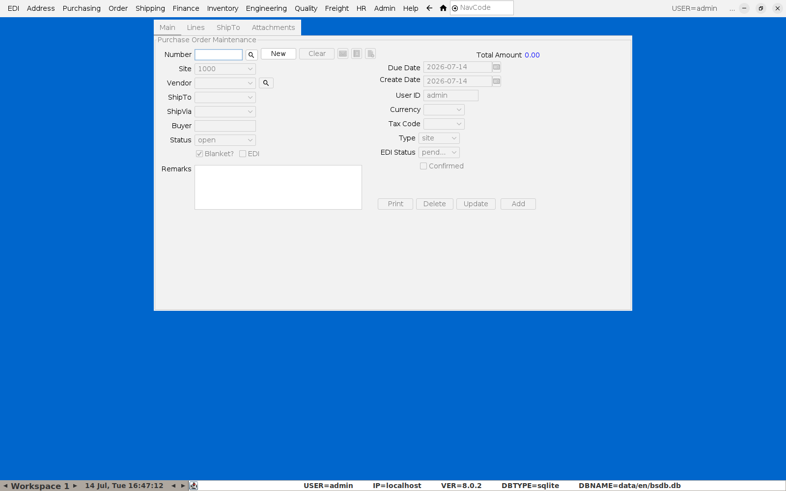
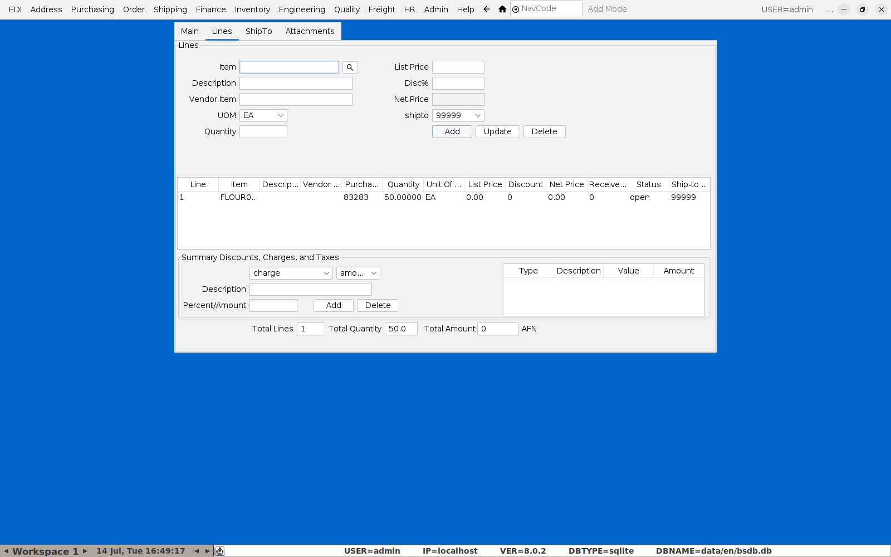
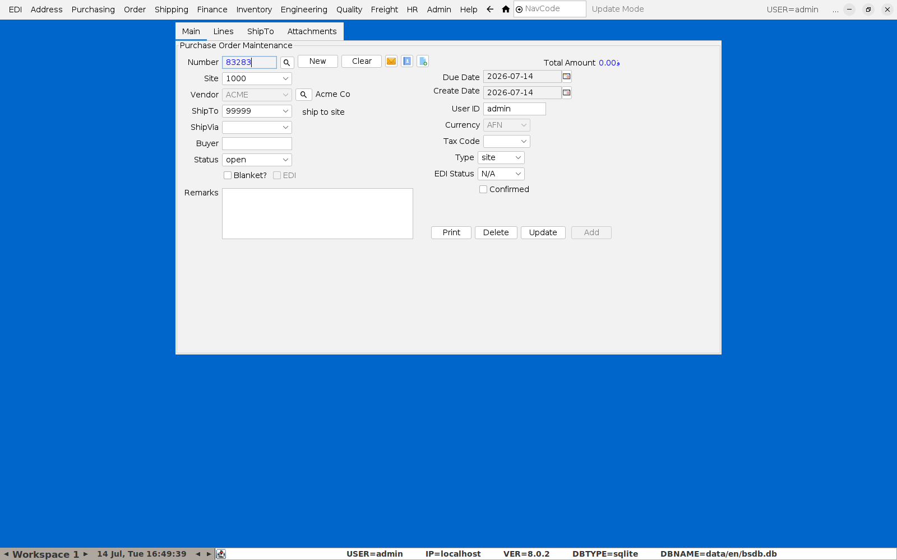
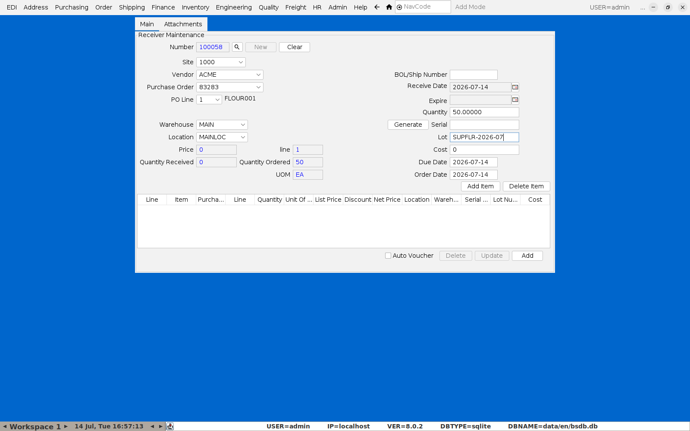
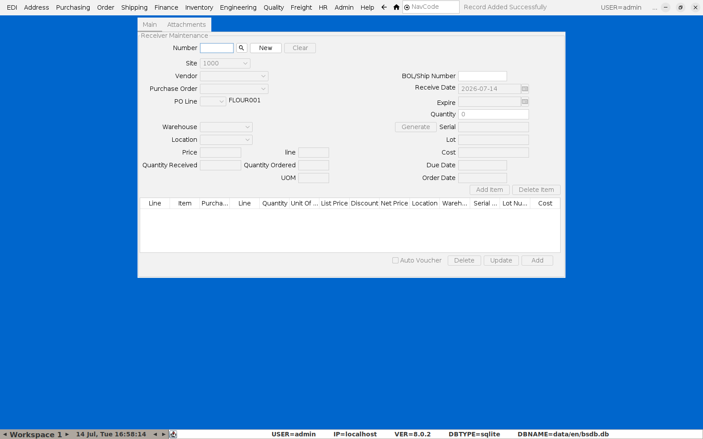

# Doing a Purchase Order / Accepting Delivery of Goods

This is a two-step flow: raise the **Purchase Order** with your vendor, then
**receive** the goods when they arrive. The receiving step is what actually
puts stock (and its supplier lot number) into inventory — a PO on its own
doesn't move any stock.

## 1. Raise the Purchase Order

**Menu:** Purchasing → Purchase Order Maintenance

Click **New**, pick the **Vendor**, and confirm **ShipTo** (defaults to the
site's own address).

Switch to the **Lines** tab and enter the **Item**, **UOM**, and **Quantity**
for what you're ordering, then click **Add**.

Go back to **Main** and click **Update** to save. The order is now **open**
and visible to the receiving process.

## 2. Receive the delivery

**Menu:** Purchasing → Receiver Maintenance

This is the screen that actually books the goods into stock — and, for a
food ingredient, records the **supplier's own lot number** against it.

Click **New** (BlueSeer assigns the next receiver number), then:

- **Vendor** — pick the supplier; this filters the **Purchase Order**
  dropdown to that vendor's open orders.
- **Purchase Order** / **PO Line** — pick the order and line being received.
  Once a line is selected, **Warehouse**, **Location**, **Quantity
  Ordered**, and **UOM** all fill in from the PO automatically.
- **Warehouse** / **Location** — where the goods are physically going.
- **Quantity** (top right, next to **Generate**/**Serial**) — how much is
  actually being received this delivery (may be less than the full PO line
  if it's a partial delivery).
- **Serial** and **Lot** — enter the **supplier's lot number** here (their
  batch code off the delivery docket/label). Serial and Lot can be the same
  value — this is what makes that incoming ingredient lot traceable later
  in [Lot Genealogy / Recall Lookup](04-lot-recall.md) if it ends up in a
  recalled batch.
- **BOL/Ship Number** — required; the delivery docket/BOL reference number
  from the supplier.

Click **Add Item** to move the line into the grid below — repeat for any
other lines/items on the same delivery.

Click **Add** at the bottom to commit the receipt. BlueSeer confirms with
"Record Added Successfully."

## What just happened

Committing the receipt does three things at once:

- Increases on-hand quantity for the item at the warehouse/location given.
- Records an `RCT-PURCH` inventory transaction carrying the supplier's lot
  number — the same lot number is now attached to the stock itself, so
  whichever batch this ingredient goes into during
  [production](03-producing-a-batch-and-labels.md) is traceable back to this
  specific delivery.
- Updates the PO line's received quantity/status.

**If the supplier's lot number isn't entered at receiving, it's gone** —
there's no later screen that lets you retroactively tag existing stock with
a lot number. Make entering it part of the receiving routine for any food
ingredient, the same way the BOL number already has to be entered.
