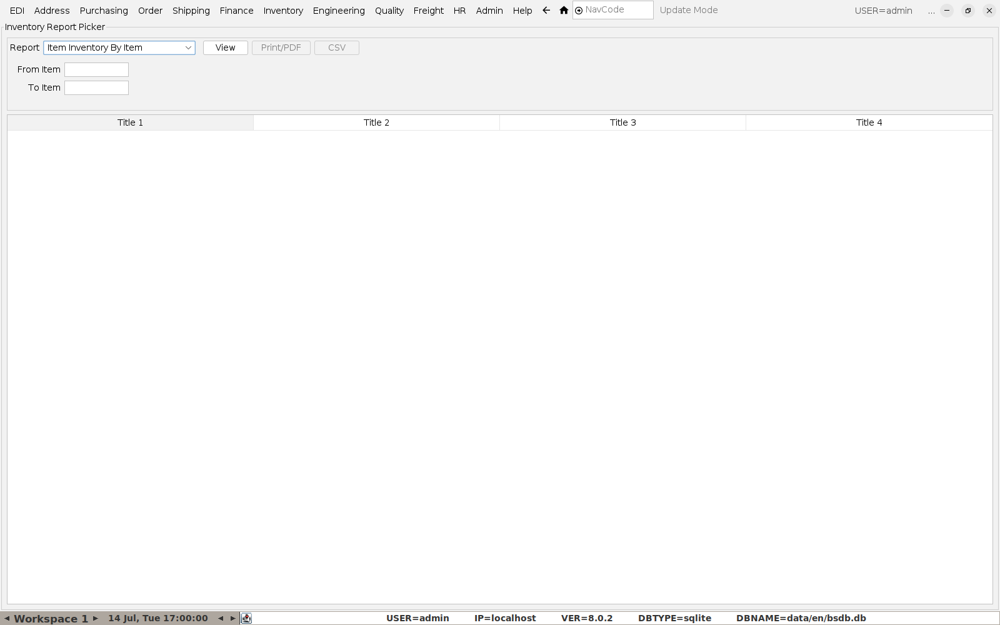
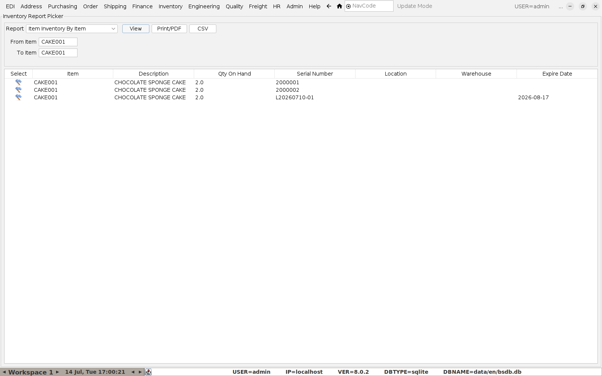
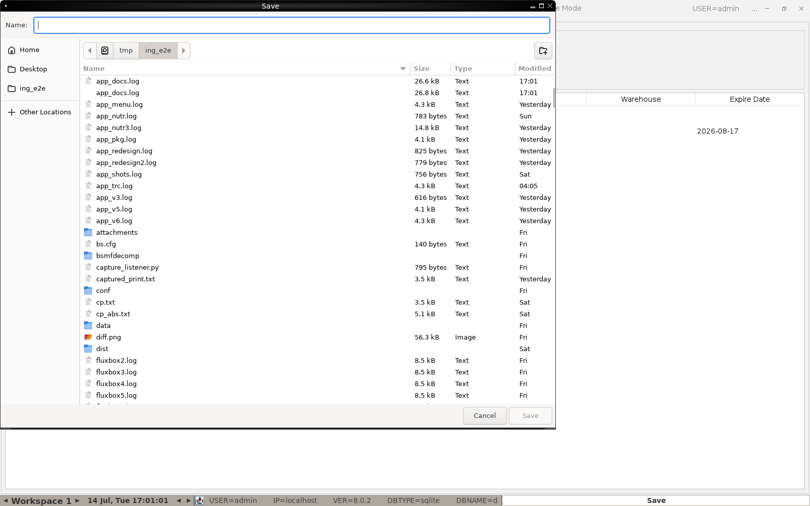

# Doing Stock Reports

**Menu:** Inventory → Inventory Report Selector

This one screen serves every stock report — pick a report from the
dropdown, fill in whatever filter fields appear, then **View** on-screen,
**Print/PDF**, or **CSV** export.

## Reports available

| Report | Use it for |
|---|---|
| **Item Info By Item Range** / **By ProdLine Range** | Item master details across a range of codes. |
| **Item Costs By Item Range** | Standard/current cost review. |
| **Item Cust Price By Item** | What a specific customer is priced at. |
| **Item Inventory By Item** | Every batch/serial currently on hand for an item, with expiry — the one to reach for day-to-day (see below). |
| **Item QOH By Item** | Simple on-hand quantity, no batch breakdown. |
| **Order Allocations By Item** | What's already committed to open sales orders. |
| **Items less than safety stock** | Reorder list — what needs a PO raised. |
| **Inventory Valuation Report** | Stock value for accounting/stock-take purposes. |
| **Inventory QOH By Warehouse** / **By Location** | On-hand totals grouped by where it's physically stored. |

## Example: Item Inventory By Item

Pick **Item Inventory By Item**, enter a **From Item**/**To Item** range
(the same code in both to check a single item), and click **View**:

This is the same batch/serial data used throughout the rest of the
system — the **Serial Number** column here is the batch number from
[Producing a Batch and Printing Labels](03-producing-a-batch-and-labels.md),
and **Expire Date** is what drives FEFO picking when
[shipping an order](05-sales-orders.md). A quick way to check what's about
to expire across the catalog without opening each item individually.

## Exporting

Click **CSV** to save the current report to a file instead of (or as well
as) viewing it on-screen — useful for a stock-take working file, or to hand
to someone who needs the raw numbers rather than a formatted report.

**Print/PDF** produces a formatted, printable version of the same report
for filing or emailing.
