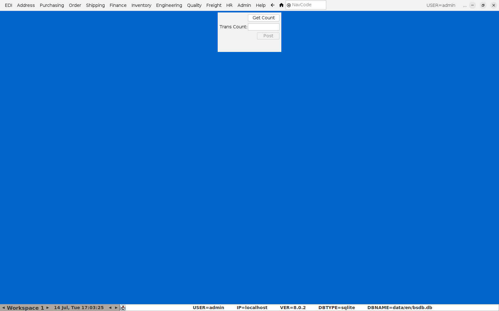
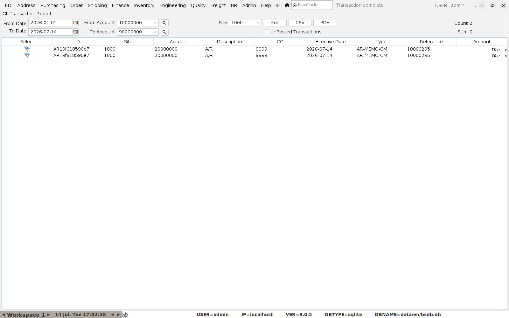

# Exporting Sales to Your Accounting System

BlueSeer keeps its own general ledger (accounts, cost centers, postings from
sales, credit notes, purchasing, etc.), but if the books of record live in a
separate accounting package (Xero, QuickBooks, Sage, or similar), use the
**GL Transaction Report** to pull a clean, dated export of everything posted
in BlueSeer and hand it to whoever maintains the external system.

## 1. Make sure everything's posted first

**Menu:** Finance → Post Transactions

Sales, credit memos, and purchasing activity sit as **unposted** GL entries
until this step runs. Click **Get Count** to see how many transactions are
waiting, then **Post** to commit them to the ledger — anything still
unposted won't show up in the transaction report below.

Do this on a schedule (daily/weekly) that matches how often you plan to
export to the external system.

## 2. Run the GL Transaction Report

**Menu:** Finance → Ledger Reports → Ledger Transaction Report

Set **From Date**/**To Date** for the period you're exporting, and a
**From Account**/**To Account** range (use the full chart-of-accounts range
to get everything, or narrow it to just the sales/A-R accounts if that's
all the external system needs). Click **Run**.

Each row is one posted GL line: **Account**, **CC** (cost center),
**Type** (e.g. `AR-MEMO-CM` for a credit memo — see
[Doing a Credit Note](06-credit-notes.md)), **Reference** (the order/invoice/
memo number it came from, so it's traceable back into BlueSeer), and
**Amount**.

## 3. Export

Click **CSV** to save the report to a file — this is the file to import
into (or hand to whoever maintains) the external accounting system. Column
order is `ID, Site, Account, Description, CC, Effective Date, Type,
Reference, Amount`. **PDF** produces a formatted, human-readable version of
the same data for filing.

## A tip on scope

Ticking **UnPosted Transactions** shows entries still waiting to be posted —
useful as a pre-export sanity check to confirm nothing's been missed before
running Post Transactions in step 1.
