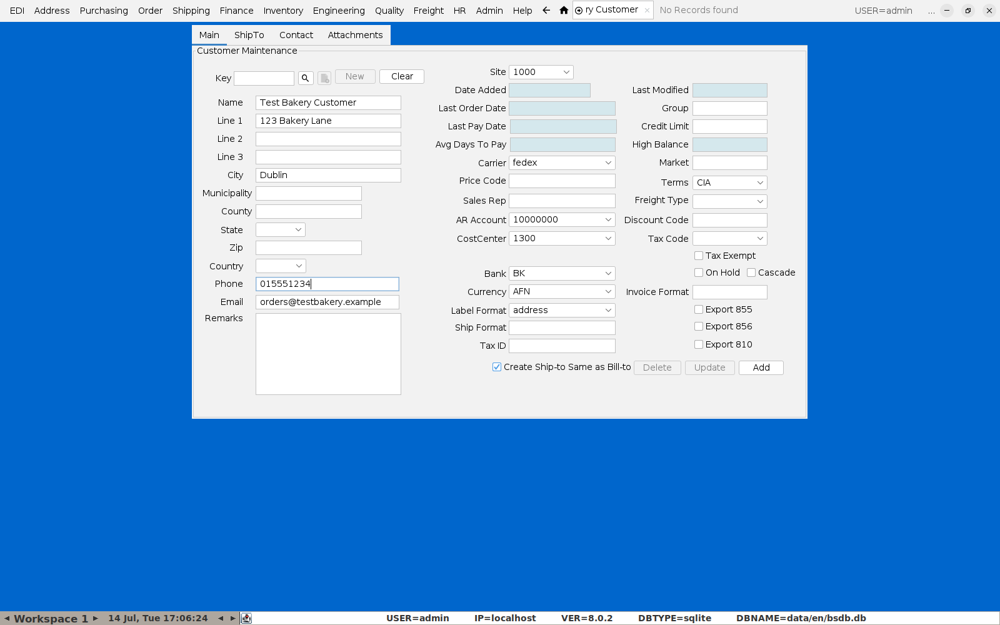
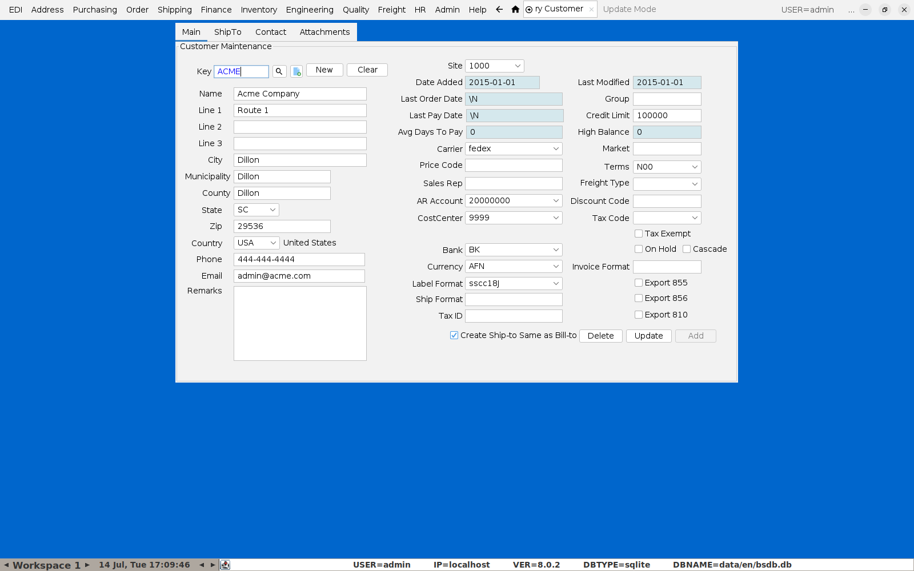
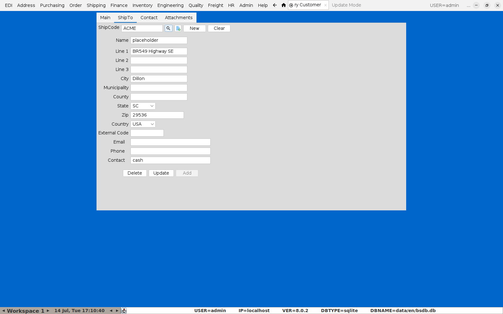
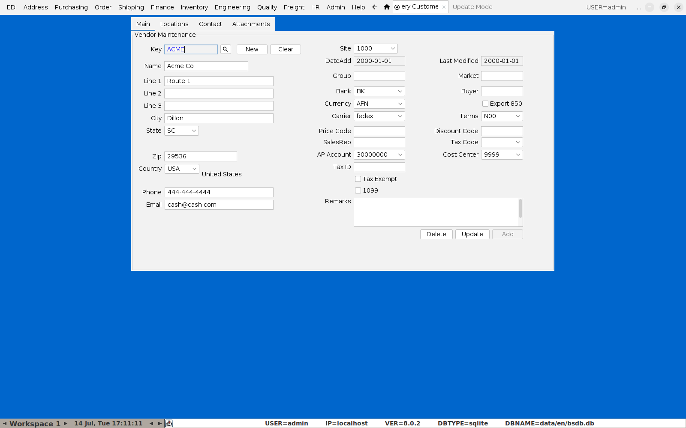

# Setting Up Customers and Vendors

Every other flow in this guide — orders, purchase orders, credit notes —
depends on a customer or vendor record existing first. This is a short
reference for setting those up.

## Customers

**Menu:** Address → Customer Menu → Customer Maintenance

Click **New**, then fill in the customer's **Key** (their short code),
**Name**, address, **Phone**, and **Email**. The right-hand column carries
the accounting defaults that flow onto every order for this customer — **AR
Account**, **CostCenter**, **Terms**, **Currency** — set these to match how
the customer should be invoiced.

Click **Add** to save.

For an existing customer, search by **Key** (or click the magnifying glass
next to Key for a full search-by-name dialog) and press Enter to load it:

### Ship-To addresses

Switch to the **ShipTo** tab to add or review delivery addresses for this
customer — a customer can have more than one **ShipCode** if they receive
deliveries at multiple locations. This is the address that appears on
[orders](05-sales-orders.md) and shippers.

Note there's no warehouse **Site** setting here — that's a separate,
site/warehouse-level configuration (Inventory menu), not something attached
to the customer record. If a serialized shipper's **Site** dropdown comes up
empty (see the note in [Putting an Order Through](05-sales-orders.md)),
that's what to check first, not the customer's Ship-To.

## Vendors

**Menu:** Address → Vendor Menu → Vendor Maintenance

Same shape as Customer Maintenance, with vendor-specific fields instead:
**AP Account** and **Cost Center** (where purchases post), **Terms**, and
**Buyer**. This is the record [Purchase Orders](07-purchase-orders.md) draw
their Vendor dropdown from.

Click **New**, fill in the fields, and **Add** to create a new vendor —
same pattern as the customer side.

## A tip

Get the accounting defaults (AR/AP account, cost center, terms) right at
setup time — every order or PO raised against this customer/vendor inherits
them, and getting them wrong here is far more tedious to fix retroactively
across every transaction than to set correctly up front.
